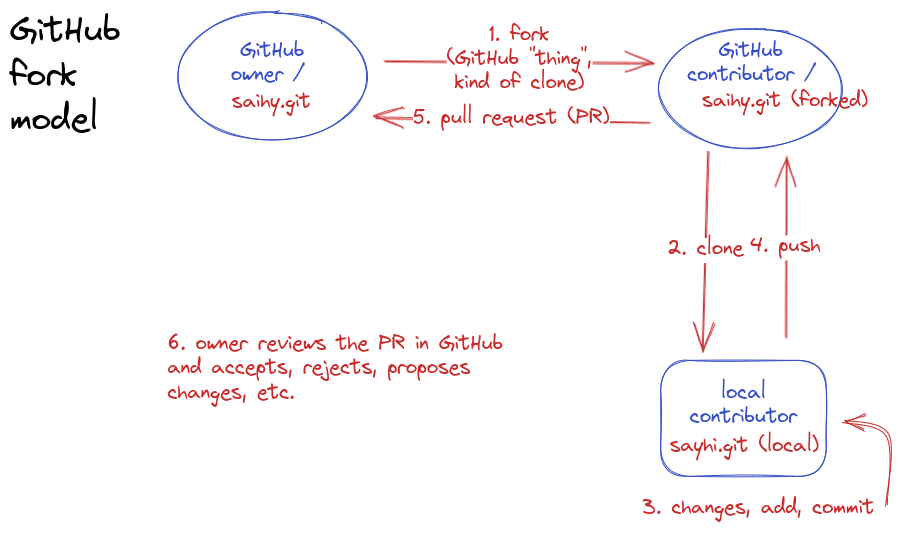

# sayhi
Playing with GitHub forks and Pull Requests (PR). Homework for 2023-01-10-cfm Software Carpentry Git lesson.

You can think of forking as a kind of `clone`, but between GitHub repos, and with GitHub being aware of a repo being forked, and where a frok "comes" from.

# sort instructions

In GitHub `fork` this repo, `clone` the forked repo (from your GitHub account) to your computer. There, add a new file named as by your GitHub username (so that you don't step on each other's foot) with a "hi!" message inside. `git add`, `commit` this new file in your local repo. Now `push` changes to your forked repo, and finally, from within GitHub interface of your forked repo, submit a pull request to this repo (iamc/sayhi).

# step-by-step instructions

0. Sign in into your GitHub account and go to this repository https://github.com/iamc/sayhi .
1. Click the upper rigth `Fork` button. As you do it you will be taken to your own account, to your `sayhi` forked repositry. Under the repository name (<YOUR_USERNAME>/sayhi), you will see the text: "Forked from iamc/sayhi".
2. Go to your computer and `clone` YOUR fork (<YOUR_USERNAME>/sayhi) (green `<> Code` button, clone, select SSH and copy-paste to your terminal): `git clone git@github.com:<YOUR_SUERNAME>/saihi.git`.
3. Create a new file <YOUR_USERNAME.txt>, put some text in it, and `git add` and `commit` the file in your local repository.
4. Push your local repo to GitHub remote repo with `git push origin main`.
5. Now in GitHub web interface you will see something like "This branch is XX commits ahead of iamc:main.", and in the same "bar" the text `Contribute`. Click there and click the `Open pull request` button in the emerging window. Write the pull request message there and click the green button `Create pull request`.
6. Now I (iamc) will get a message about your PR submission. As your username is unique in GitHub, and you so named the new file, there will be no conflicts with my repository; I'll review your PR and accept it. This will be reflected in your forked repo and this will have been your first pull request ever and your first step into the open source contribution Hall of Fame :-)

Enjoy!
